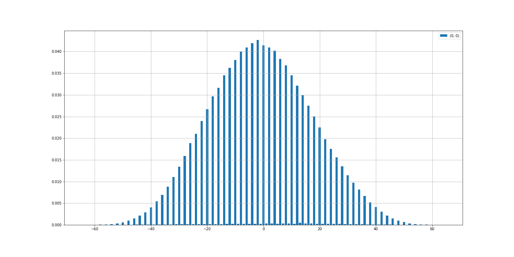
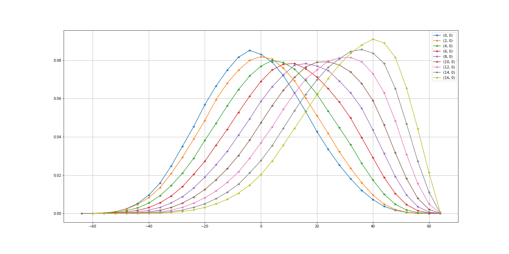
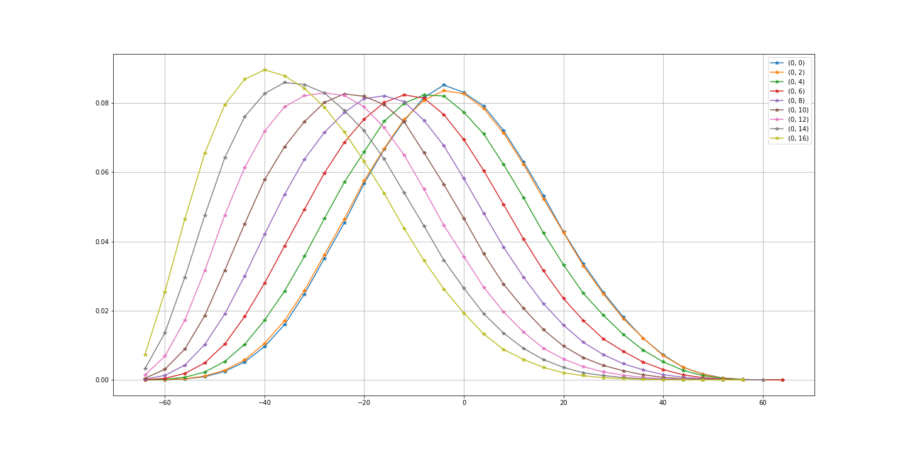
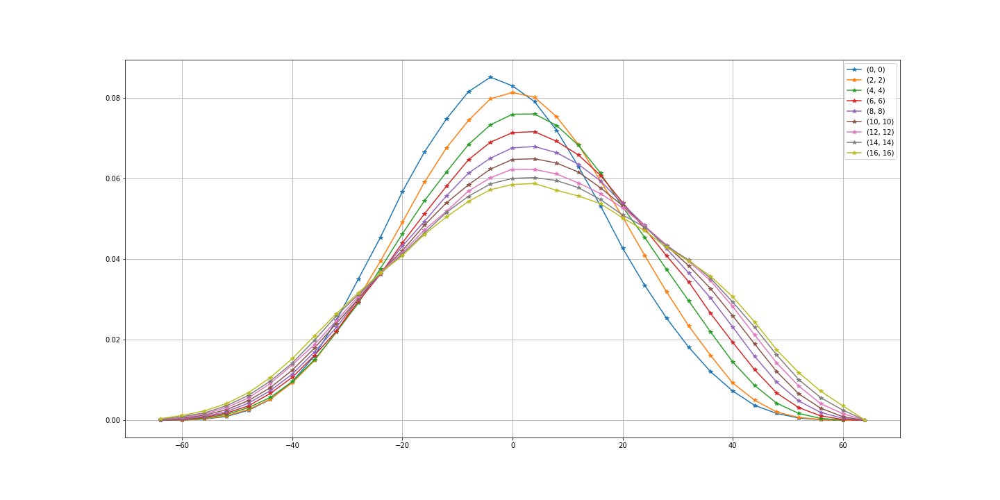
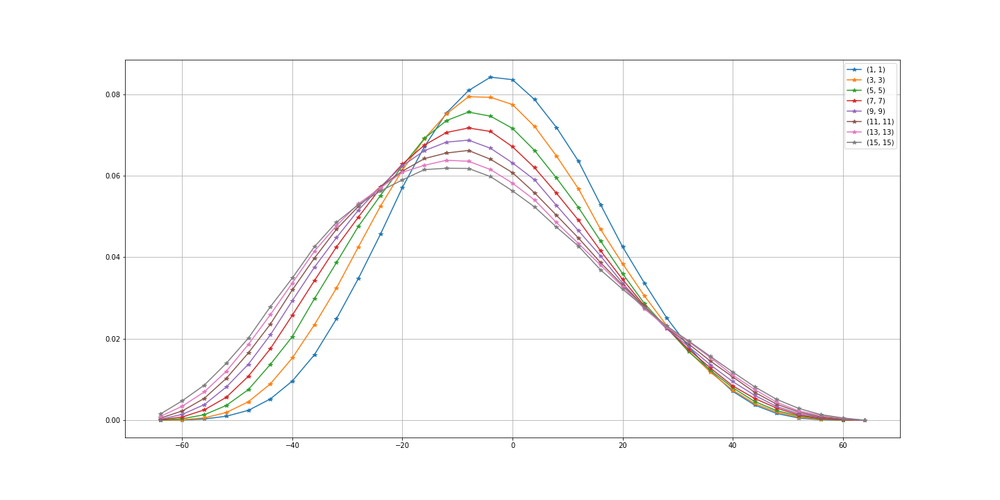
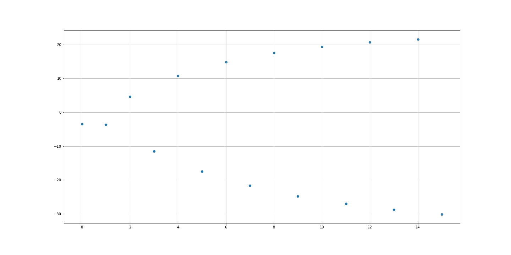

# reversi

## count pattern

N手指した時の盤面数。
ユニーク化したものとそうでないもの。
(12以降はユニーク化したもののみ)

```
1
  1->1
  1->4
2
  1->3
  4->12
3
  3->14
  12->54
4
  14->60
  54->236
5
  60->322
  236->1288
6
  322->1773
  1288->7092
7
  1773->10649
  7092->42614
8
  10649->67245
  42614->269352
9
  67245->434015
  269352->1743536
10
  434015->2958541
  1743536->11922386
11
  2958541->19786113
  11922386->80208724
12
  19786113->137639826
13
  137639826->911978410
```

## ランダム打ちの統計情報

問:
オセロの初期状態から初めて通常のルール通り黒番白番の順にゲーム終了まで着手する。
この時、空きマスが残り $N$以下になるまでは着手可能な場所から一様ランダムに手を選択する、空きマスが残り$N$以下になったら全探索により最善手を選択する。
決着時の黒枚数-白枚数の分布は？

1試合シミュレーションするのに $N=0$ だと 80 マイクロ秒くらい（早い）、 $N=10$ だと 5ミリ秒くらい（早い）、 $N=15$ だと3~10秒くらい（遅い）かかる。
指数ってすごい。

### お互いが完全にランダムに打った場合

まずは $N=0$ での結果。
横軸は $(黒枚数)-(白枚数)$、縦軸は頻度（全体をサンプル数で割っている、棒グラフの面積の合計が1になる）。
全てのマスが埋まったらスコア差は必ず偶数になるはずで、グラフを見る限り高確率でそうなっていそうだとわかる

* サンプル数: 985,703
* 平均: -0.8628410383249313
* √分散: 18.200954129244945

結果として白が若干有利。



### どちらかだけ最終N手を完全探索した場合

次にどちらかだけ $N=0,2,...,16$ と変化させた時のグラフ。
棒グラフだと見辛いので折れ線グラフにした。
あと、横軸 $x$ について、 $\lfloor x/4 \rfloor * 4$ による粗視化をしている。

順当に探索を行う深さが深くなるほど強くなっているのがわかる。
$N=2$ で分布が $x=0$ で対称になっているように見えるので、これは黒が最後の1手を適切に選びさえすれば互角になるということ。
$N=16$ まで行くと流石に圧倒的な強さが見えるが $x\lt 0$ もまだボチボチあるので面白い。

黒のみが完全探索



白のみが完全探索



### 両者が最終N手を完全探索

両者ともに $N=0,2,...,16$ と変化させた時のグラフ。



両者ともに $N=1,3,...,15$ と変化させた時のグラフ。



横軸を最終$N$手のNとして、縦軸を最終石数差の平均にしたもの。
$N$が大きくなるほど「1手早く読み始める」ことの大事さが大きくなっている。
本当でござるか？って気分はある。


